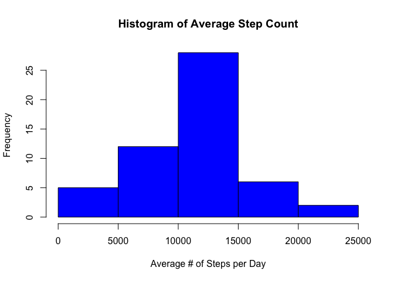
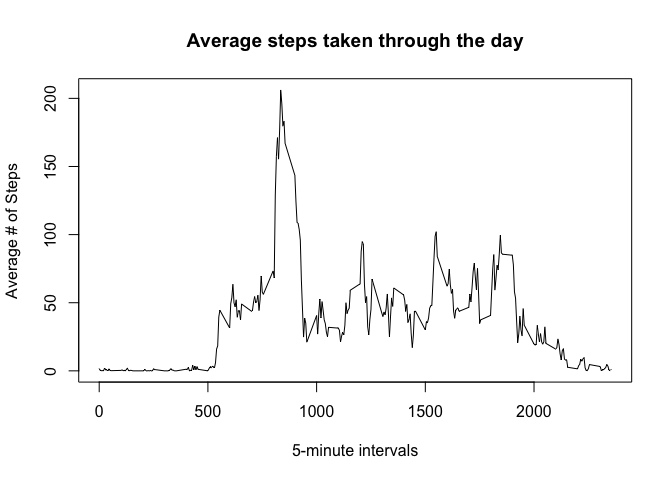
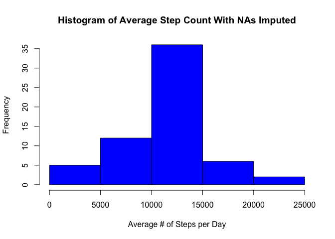
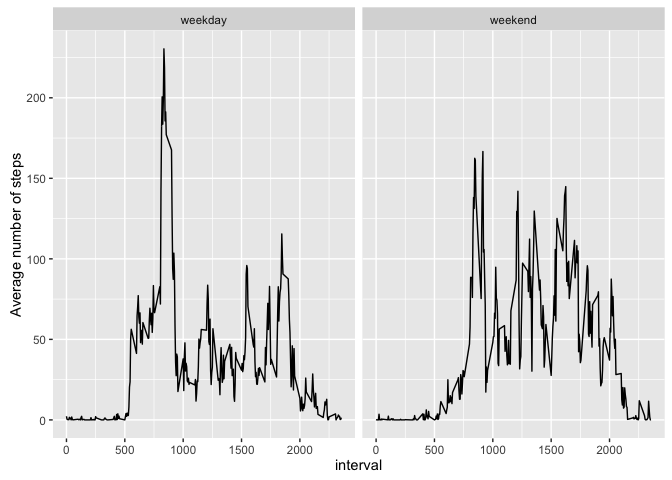

# Reproducible Research: Peer Assessment 1
Author: Steven Magana-Zook

## Loading and preprocessing the data
This code assumes you have unziped the activity.zip file to the working directory. 
Note, this repo contains the activity.csv file already unzipped, just set your working directory to this git repository's folder.

1. Read in the activity.csv file to the activity data frame

```r
activity  = read.csv("activity.csv")
```
2. At this point there is no additional pre-processing neccessary. 
Later we will need to manipulate the date column to complete the plots required.


## What is mean total number of steps taken per day?
First, we will make a histogram of the number of steps taken per day. To do this, first group by the date column and compute the sum of the steps for each date. The dplyr package will help us with this.

```r
library("dplyr")
```

```
## 
## Attaching package: 'dplyr'
```

```
## The following objects are masked from 'package:stats':
## 
##     filter, lag
```

```
## The following objects are masked from 'package:base':
## 
##     intersect, setdiff, setequal, union
```

```r
countSteps = activity %>% group_by(date) %>% summarise(sumSteps=sum(steps))
hist(countSteps$sumSteps, col="Blue", main="Histogram of Average Step Count", xlab="Average # of Steps per Day" )
```

<!-- -->

Now lets compute the mean and median number of steps taken per day.

```r
meanSteps = activity %>% group_by(date) %>% summarise(avg=mean(steps,na.rm = TRUE))
medianSteps = activity %>% group_by(date) %>% summarise(avg=median(steps,na.rm = TRUE))

print(meanSteps)
```

```
## # A tibble: 61 × 2
##          date      avg
##        <fctr>    <dbl>
## 1  2012-10-01      NaN
## 2  2012-10-02  0.43750
## 3  2012-10-03 39.41667
## 4  2012-10-04 42.06944
## 5  2012-10-05 46.15972
## 6  2012-10-06 53.54167
## 7  2012-10-07 38.24653
## 8  2012-10-08      NaN
## 9  2012-10-09 44.48264
## 10 2012-10-10 34.37500
## # ... with 51 more rows
```

```r
print(medianSteps)
```

```
## # A tibble: 61 × 2
##          date   avg
##        <fctr> <dbl>
## 1  2012-10-01    NA
## 2  2012-10-02     0
## 3  2012-10-03     0
## 4  2012-10-04     0
## 5  2012-10-05     0
## 6  2012-10-06     0
## 7  2012-10-07     0
## 8  2012-10-08    NA
## 9  2012-10-09     0
## 10 2012-10-10     0
## # ... with 51 more rows
```

## What is the average daily activity pattern?
Lets visualize the avergae number of steps taken per 5-minute interval.

```r
avg5min = activity %>% group_by(interval) %>% summarise(avg=mean(steps,na.rm = TRUE))
plot(x=avg5min$interval, 
     y=avg5min$avg, 
     type="l", 
     main="Average steps taken through the day", 
     xlab="5-minute intervals", ylab="Average # of Steps")
```

<!-- -->

Looks like the most steps are taken mid-morning.

Lets now find the maximum number of average steps

```r
maxAvgSteps = max(avg5min$avg)
maxInterval = avg5min %>% filter(avg == maxAvgSteps) %>% select(interval)
```

The maximum average number of steps taken is: 206.1698113.

The interval containing the maximum average number of steps is: 835.

## Imputing missing values
Not every day-interval has a number of steps reported. We can find out how many by using this code:


```r
numNoStepsReported = length(activity$interval[is.na(activity$steps)])
```

We see there are 2304 number of such cases.

To fill these NA values in, we can reuse our avg5min variable to subsititute in the mean for missing values creating a new dataset:

```r
imputed = activity %>% 
  left_join(avg5min, by="interval") %>% 
  mutate(steps = ifelse(test = is.na(steps),avg,steps)) %>% 
  select(steps,date,interval)
```

We can now produce a histogram that includes the imputed values:

```r
countStepsImputed = imputed %>% group_by(date) %>% summarise(sumSteps=sum(steps))
hist(countStepsImputed$sumSteps, 
     col="Blue", 
     main="Histogram of Average Step Count With NAs Imputed", 
     xlab="Average # of Steps per Day" )
```

<!-- -->

We can also calculate the new mean and median values:

```r
meanStepsImputed = imputed %>% group_by(date) %>% summarise(avg=mean(steps))
medianStepsImputed = imputed %>% group_by(date) %>% summarise(avg=median(steps)) 
head(meanStepsImputed)
```

```
## # A tibble: 6 × 2
##         date      avg
##       <fctr>    <dbl>
## 1 2012-10-01 37.38260
## 2 2012-10-02  0.43750
## 3 2012-10-03 39.41667
## 4 2012-10-04 42.06944
## 5 2012-10-05 46.15972
## 6 2012-10-06 53.54167
```

```r
head(medianStepsImputed)
```

```
## # A tibble: 6 × 2
##         date      avg
##       <fctr>    <dbl>
## 1 2012-10-01 34.11321
## 2 2012-10-02  0.00000
## 3 2012-10-03  0.00000
## 4 2012-10-04  0.00000
## 5 2012-10-05  0.00000
## 6 2012-10-06  0.00000
```

We see generally that the average number of steps has increased since imputing values for the NAs. Specifically compare the two histograms for the 10,000 to 15,000 bin.

## Are there differences in activity patterns between weekdays and weekends?

Lets first create a new column to hold the weekday/weekend values by using the POSIXlt class to extract the weekday number:

```r
imputed$date = as.POSIXlt(imputed$date)
imputed$daytype = ifelse(imputed$date$wday %in% c(0,6), "weekend","weekday")
imputed$daytype = factor(imputed$daytype )
head(imputed)
```

```
##       steps       date interval daytype
## 1 1.7169811 2012-10-01        0 weekday
## 2 0.3396226 2012-10-01        5 weekday
## 3 0.1320755 2012-10-01       10 weekday
## 4 0.1509434 2012-10-01       15 weekday
## 5 0.0754717 2012-10-01       20 weekday
## 6 2.0943396 2012-10-01       25 weekday
```

We can now visualize differences in walking during the week and on the weekend.

```r
library("ggplot2")
imputed$date = as.character(imputed$date)
imputed$date = factor(imputed$date)
avgStepsPerIntervalPerDayType = imputed %>% group_by(interval,daytype) %>% summarise(avg=mean(steps))
qplot(data=avgStepsPerIntervalPerDayType,x = interval, y=avg, facets=.~daytype, geom = "line", ylab="Average number of steps")
```

<!-- -->

